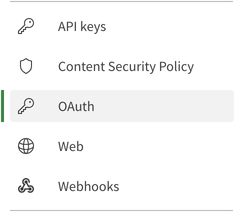
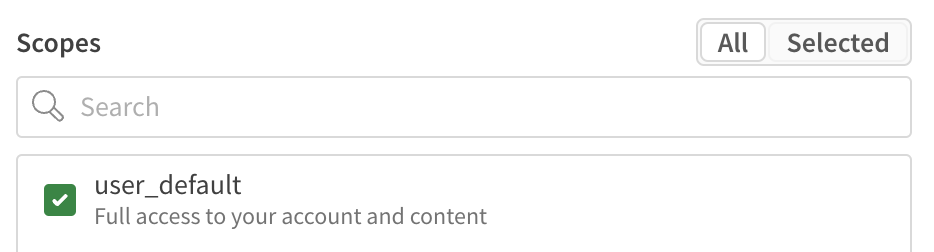
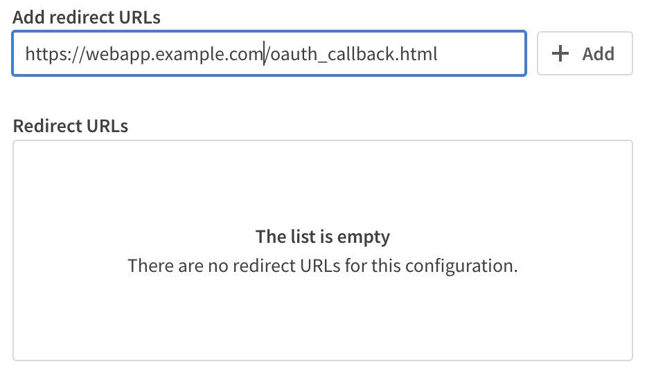
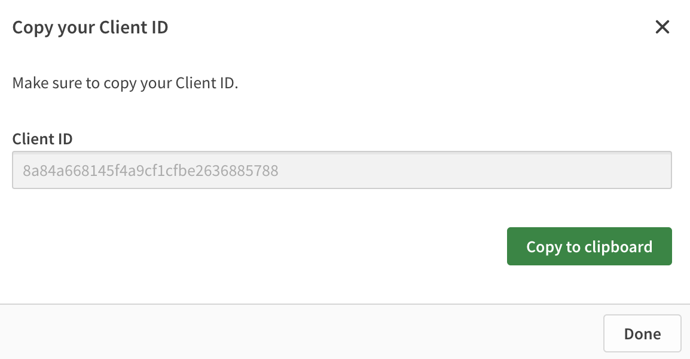

# 2 Configure the Qlik Cloud tenant

## 2.1 Create a single-page application OAuth client

Select `OAuth` from the Management Console menu.

</img>

Click the `Create new` button on the upper right side of the screen.

* From the `Client type` dropdown list, select *Single-page app*.
* In the `Name` input give your OAuth client a friendly name.
* *Optional:* In the `Description` input, add some information about the OAuth client.

### 2.1.1 Select OAuth client scopes

Select `user_default` within the Scopes selection window.

</img>

### 2.1.2 Add redirect URL

> **Note:** If you're using [repl.it](https://replit.com), the redirect URL is the address you obtained in [1.1.3](#113-obtain-the-web-application-address) with the addition of a location for the OAuth client should return to after the user authorizes, known as the callback page. The callback page for the tutorial is `oauth-callback.html`.

In the Redirect URLs input, enter the URL the OAuth client should redirect to and press the `Add` button.

</img>

### 2.1.3 Add allowed origins

> **Note:** If you're using [repl.it](https://replit.com), the allowed origin is the address you obtained in [1.1.3](#113-obtain-the-web-application-address). Make sure to remove any trailing slashes at the end of the URL.

In the Allowed origins input, enter the URL for the web application and press the `Add` button.

</img>

### 2.1.4 Obtain the OAuth client id

Press the `Create` button to save the OAuth client configuration. Record the Client ID value for later use.

</img>

## 2.2 Download content

Download the [Sales Analytics_Workshop.qvf](https://github.com/goldbergjeffrey/qlik-embedded-analytics-workshop/raw/main/content-to-upload/app/Sales%20Analytics_Workshop.qvf) file from the Github repository.

Download the [embeddedtheme.zip](https://github.com/goldbergjeffrey/qlik-embedded-analytics-workshop/raw/main/content-to-upload/theme/embeddedtheme.zip) file from the Github repository.

## 2.3 Import Qlik Sense app

Login to your Qlik Cloud tenant. When the hub appears, click the `Add new` button and select `Upload app` from the dropdown list.

</img>

In the dialog window that appears, browse for the Sales Analytics_Workshop.qvf file and select it. Then, click the `Upload` button.

</img>

A card for the app will appear in the hub. Mouse over the app and click the open button.

</img>

Record the ID (highlighted) of the app from the address bar in your web browser. You will use this in the web application configuration later in the workshop.

## 2.4 Import theme file

Click the Launcher menu (it looks like a waffle on the upper right of the screen) and select the Management Console icon.

</img>

Select `Themes` from the Management Console menu.

</img>

Click the `Add` button on the upper right side of the screen. Browse for the embeddedtheme.zip file you downloaded in [2.2](#22-download-content) and upload it to the tenant.

</img>

