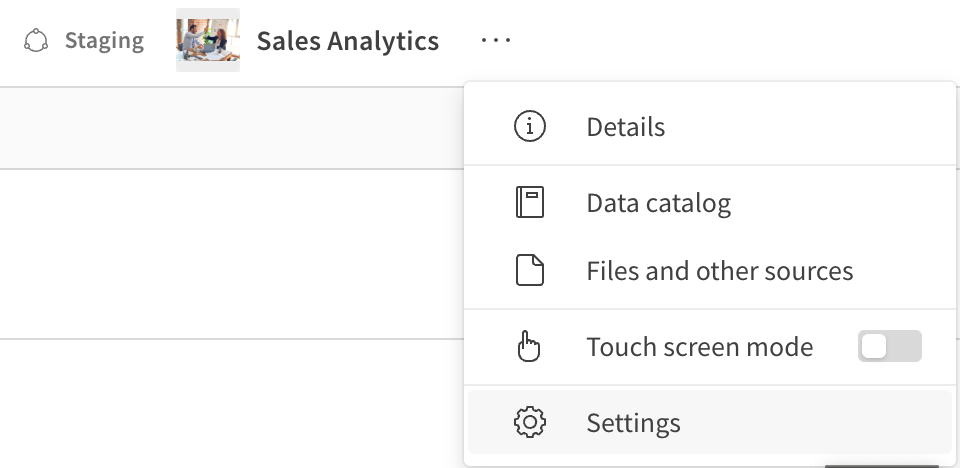
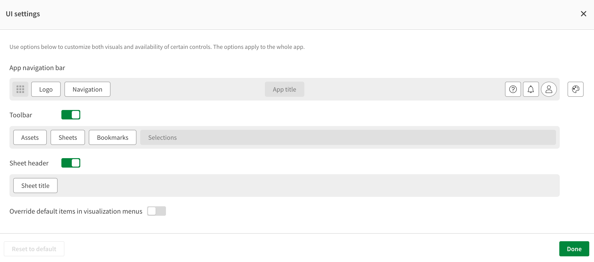
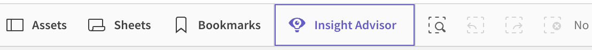
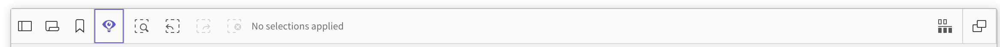
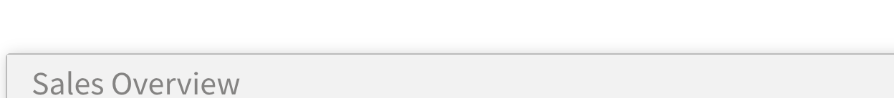
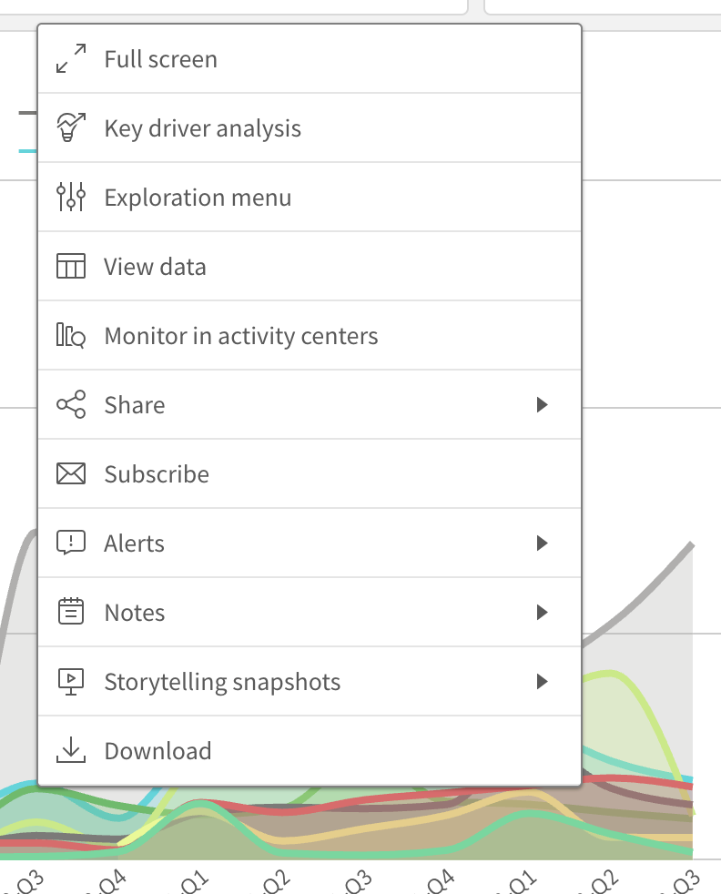
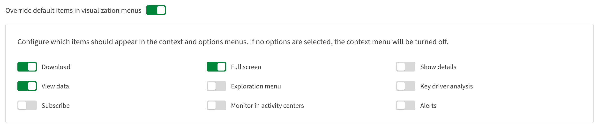
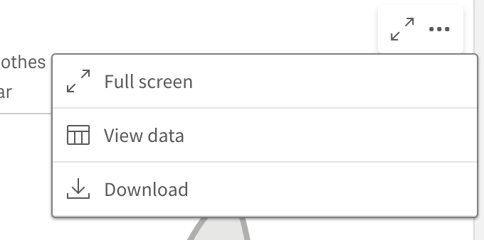

# 5 Customize classic/app UI toolbars and context menus

## 5.1 Open the app’s settings panel

Navigate to your tenant and access the Analytics Activity Center. Open the Sales Analytics app in the Staging space by clicking on the card. Select the **…** menu next to the app name and choose **Settings**.

</img>

## 5.2 Open UI settings

In the right‑hand Settings pane you’ll see a “UI settings” header with a pencil (✎) icon. Click it to open the UI settings window.

</img>

## 5.3 The UI settings window

The UI settings window has several sections including the:

* Navigation bar which controls the very top bar of an analytics application.
* Toolbar containing the shortcuts for accessing content in and using features of analytics applications.
* Sheet title toggle controls its visibility.
* Context menu configuration to control visibility to additional features in analytics applications.

</img>

When an analytics developer creates an application and configures these properties they will automatically update the analytics client user interface.

## 5.4 Adjusting the Toolbar

From the application overview open a sheet to the application. The toolbar will have a set of icons on the left side of the user interface.

</img>

The toolbar may appear different in the browser from an embedded classic/app because of the sizing of the embedding container.

</img>

## 5.4.1 Hiding the Toolbar

You can hide the entire toolbar by sliding the toggle off. You can toggle visibility for certain items on the toolbar by clicking on them. Go into UI settings, flip **Toolbar** off (grey), then **Done** again.

</img>

Return to the hello-classic-app page in the web application and you will see the toolbar is no longer visible.

</img>

## 5.2 Simplify each chart’s context menu

The context menu contains a variety of actions you can take on visualizations you see in classic/app and classic/chart UIs. You may want to restrict the visibility of some or all of these actions depending on your embedding use case.

</img>

## 5.3 Configure context menu options

Reopening UI settings and toggle on **Override default items in visualization menus**. From here, you can control the visibility of individual context menu items. Select a few options and save.

</img>

## 5.4 Confirm the new, minimal context menu

Return to the classic/app page of the web application and open a sheet. Right-click on any visualization to see the updated context menu.

</img>

And that’s it! You’ve used the built‑in UI settings to tailor the navigation bar, toolbar, sheet header and the items shown in each visualization’s menu.

