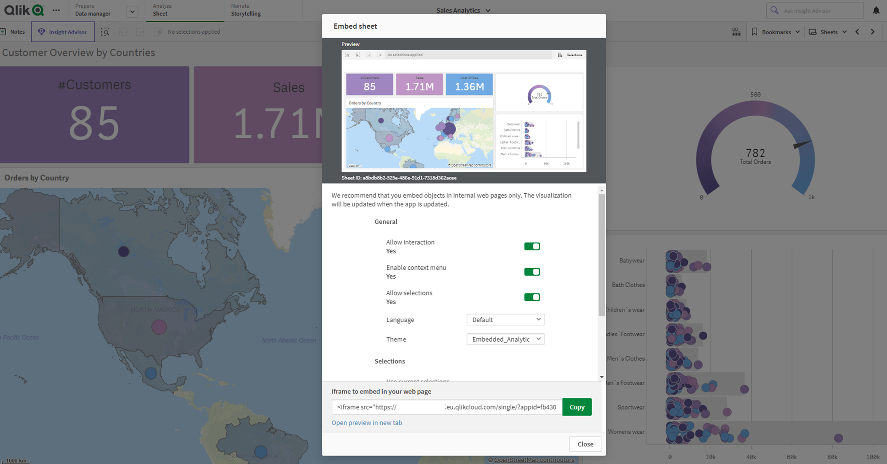

# Qlik Cloud Embedded Analytics Workshop

## Introduction
Welcome to this hands-on workshop on embedding visualizations from Qlik Cloud Analytics! In today's data-driven world, businesses need to quickly access and share insights from their data to make informed decisions. With Qlik Cloud Analytics, you can easily create powerful visualizations that enable you to explore your data and gain valuable insights.

In this workshop, we will guide you through the process of embedding visualizations from Qlik Cloud Analytics into your web applications, making it easier to share insights with your team or customers. You will learn how to leverage the Qlik Cloud Analytics APIs and embed codes to integrate visualizations directly into your web pages.

This workshop is designed for individuals with a basic understanding of web development, but no prior experience with Qlik Cloud Analytics is required. We'll start with some tenant configuration, then dive into the hands-on exercises where you will get to practice embedding visualizations into this web application.

By the end of this workshop, you will have the skills to integrate powerful data visualizations from Qlik Cloud Analytics into your web applications, allowing you to deliver insights to your stakeholders quickly and easily.


## Requirements

* A Qlik Cloud tenant
* An account on the tenant with the Tenant Admin role
* A Github account and access to an online sandbox solution like [repl.it](https://replit.com/) or [stackblitz](https://stackblitz.com/)

## Workshop steps

- [Configure the Qlik Cloud tenant](#configure-the-qlik-cloud-tenant)
  - [Import content](#import-content)
  - [Create a web integration](#create-a-web-integration)
  - [Add content security policy entry](#add-content-security-policy-entry)

- [Qlik Cloud Embedded Analytics Workshop](#qlik-cloud-embedded-analytics-workshop)
  - [Introduction](#introduction)
    - [Pre-requisites](#pre-requisites)
- [Table of contents](#table-of-contents)
  - [1. Getting Started](#1-getting-started)
  - [3. Javascript integration (Nebula.js)](#3-javascript-integration-nebulajs)
  - [4. On The Fly Visualization (Nebula.js)](#4-on-the-fly-visualization-nebulajs)
  - [5. Embed Selections bar](#5-embed-selections-bar)
  - [7. Trigger some actions via APIs on Qlik Engine](#7-trigger-some-actions-via-apis-on-qlik-engine)
    - [7.1 Clear all filters](#71-clear-all-filters)
    - [7.2 Apply selection: 'Italy'](#72-apply-selection-italy)
  - [8. On The Fly - advanced](#8-on-the-fly---advanced)
  

  
<br>

## 1. Getting Started
1. Download and unpack, or `git clone` this repository into your computer

1. **Download Sales_Analytics_Workshop.qvf** located inside */content-to-upload/app/* folder: load the app in your Qlik Cloud Tenant. This is the .qvf we will use during the workshop to create the mashup.  

1. **Download Embedded_Analytics_Workshop.zip** located inside */content-to-upload/theme/* folder: navigate to *https://{your-tenant-hostname}.{region}.qlikcloud.com/console/themes/* and import the theme inside your tenant. The same theme file is located in the folder */themes/*. We will use this theme file to apply the theme in our Javascript integration (step 6.). After you imported the theme please apply it to the previously imported app inside the App Overview menu.

1. **Install Node.js** if you haven't already (https://nodejs.org) 

1. (Optional) In *server.js* change server port at line 4.

1. Go to *https://{your-tenant-hostname}.{region}.qlikcloud.com/console* and create a new **Web Integration** under the **Web** menu by adding *https://127.0.0.1:{port_number}* as the origin since this is the address of the local webserver hosting the mashup. A web integration is a resource representing a list of whitelisted origins that can make requests to a specified tenant. It is the implementation of the **CORS** mechanism within Qlik Sense SaaS. To know more about Web Integration please refer to [this page](https://qlik.dev/basics/authentication-options#web-integrations) of our online documentation.

1. Go to *https://{your-tenant-hostname}.{region}.qlikcloud.com/console* and create a new **Policy** under the **Content Security Policy** menu by adding *127.0.0.1:{port_number}* as the origin since this will be the origin from where the Iframe is loaded. As directives please check *frame-ancestors*. To know more about Content Security Policy please refer to [this page](https://qlik.dev/basics/content-security-policy) on Qlik.dev .

1. Under */config/* project's folder modify **config.js** file by adding: 
    * Web Integration Id created at step 1.2
    * Id of the imported App
    * Id of the sheet to embed via Iframe (you can leave the default value)

1. Open up a terminal window and `cd` into the source code folder and run `npm install` to install the project dependencies

1. **Self-signed certificate for running a local HTTPS server that hosts the mashup (test purpose)**: 
   * Create a directory called server_certs
   * Open the directory in a terminal window
   * Install OpenSSL
   * Generate **server.key** and **server.cert** certificates inside the server_certs using the Generate a self-signed certificate command from the following link : [https://timonweb.com/javascript/running-expressjs-server-over-https/](https://timonweb.com/javascript/running-expressjs-server-over-https/).
      ```javascript
      https_exp.createServer({
          key: fs.readFileSync('./server_certs/server.key'),
          cert: fs.readFileSync('./server_certs/server.cert')
        }, app)
        .listen(port, '127.0.0.1', function () {
          console.log('Https Server listening on port 1234! Go to https://127.0.0.1:'+port+'/')
        })
   ```
1. Run `npm start` which should start a development server, open the link you see in your terminal (likely https://127.0.0.1:1234)

<br>

## 2. Iframe Integration
The simplest method of embedding analytics built with Qlik Sense into your solutions is certainly through the use of an Iframe. An Iframe is generally used to show the content of a web resource, in our case Qlik Sense, within a frame of a web page/main portal. This is what I call "integration with a one single click of the mouse".

We offer 2 different libraries to embed content via Iframe:
* [Single Integration APIs](https://qlik.dev/apis/javascript/single-integrations) : to embed a single sheet of the app or a single object of a given sheet. 
*  [App Integration APIs](https://qlik.dev/apis/javascript/app-integration) : the App Integration API provides parameters that can be used to create a URL that returns a complete HTML page containing the embedded app. This is the way to go if you want to embed Self-Service menu to offer the possibility to users to create new sheets (under a valid Professional license).

### 2.1 Single Integration (Embed sheet/objects)
To start using this capability, simply head over to a sheet, right click on a visualization, and choose "Embed chart" from the context menu. If you want instead to embed the entire sheet like in our case, click on the top-left context menu of the app and choose "Embed sheet" like in the example below.

In this section we are going to place in the div *iframe_div* of *iframe.html* web page an iframe containing a sheet of the app.
In order to create the Iframe, go to your Qlik Sense app, right click on top-left context menu --> share --> embed. Here chose the options you want and copy the generated iframe link as in the picture below.

<p>

</p>

* **HTML** : in *iframe.html* HTML file located in */src/* folder we have already created the following Iframe tag:
    ```HTML
    <iframe id="iframe" src="" style="border:none;width:100%;height:100%;"></iframe>
    ```
* **JS** : in *iframe.js* JS file located in */src/qlik/* folder we have already inserted the following code to fill the src of the iframe with the embedded sheet via Single Integration APIs:
    ```javascript
      //2.1 single integration apis
      if(page=='iframe.html'){
          var iframe_url = `https://${config.tenantHostname}/single/?appid=${config.appId}&sheet=${config.sheetId}&theme=${config.theme}`;
          document.getElementById("iframe").src= iframe_url;
      }
    ```
Please note there are different levels of customization of an Iframe such as allowing or not interaction, applying an app theme when the app is rendered (like we did), applying bookmarks etc.

### 2.2 App Integration (Embed Self-Service)
If you want to embed the entire app to enable self-service for Professional users (e.g. creating new sheets), this is the way to go.
* **HTML** : in *iframe.html* HTML file located in */src/* folder we have already created the following Iframe tag:
    ```HTML
    <iframe id="iframe" src="" style="border:none;width:100%;height:100%;"></iframe>
    ```/div>

* **JS** : in *iframe.js* JS file located in */src/qlik/* folder we have already inserted the following code to fill the src of the iframe with the embedded app via App Integration APIs: 
  ```javascript
      //2.2 app integration apis (for Self-Service)
      if(page=='self-service.html'){
          var iframe_url = `https://${config.tenantHostname}/sense/app/${config.appId}/overview`;
          document.getElementById("iframe").src= iframe_url; 
      }
  ```
In the code above the values from the config file will automatic create the correct URL and insert them to the Iframe src tag. Navigate to the https://127.0.0.1:<yourPort> and select Iframe Analytics from the menu.

## 3. Javascript integration (Nebula.js)
Qlik modern Embedded Analytics solutions offers a stack of open-source libraries to build customized analytical platforms backed up with the robustness of Qlik’s Associative Engine. Historically, [Capability APIs](https://qlik.dev/apis/javascript/capabilities) have been extensively used to build mashups and perform application related operations. A more modern alternative and framework-agnostic offering to Capability API-based operations is [Nebula.js](https://qlik.dev/libraries-and-tools/nebulajs) and [Enigma.js](https://qlik.dev/libraries-and-tools/enigmajs).

**Enigma.js** is an open source library, developed on GitHub that helps you to communicate with the Qlik associative engine. You can use it as a wrapper to connect to Qlik Associative Engine and by using QIX api methods. 
On the other hand, **Nebula.js** is an open source library, developed on GitHub as a collection of product and framework agnostic JavaScript libraries and APIs that helps developers integrate visualizations and mashups on top of the Qlik associative engine.

**How this works?** The first thing we need to do is to install or import the right libraries to be used in the project. For this workshop we have already imported in the header of *index.html* HTML file located under */src/* path both *Enigma.js* and *Nebula.js* libraries. In particular for *Nebula.js* we've loaded all the visualization types needed for embedding the objects of the app. This can be obtained by importing the module in the .html file or either by installing the required modules via `npm`.  In **mashup.js** located under */qlik/* folder, we have already established a *websocket* connection to Qlik Engine and once a session has been created, we've opened the app using QIX Engine APIs *openDoc()* method. 
```javascript
    // Open the application
    const app = await (await session.open()).openDoc(config.appId);
``` 
Moreover we have already configured *nuked*, e.g. the *Nebula.js* object where we've declared all the types of visualizations we want to embed.
 * **JS**  To embed an existing visualizations inside the HTML template, *index.html* webpage, write the following snippet of code inside *mashup.js* script:
    ```javascript
    //3. Embed using Nebula.js
    nuked.render({
        element:document.getElementById('KPI01'),
        id:'ejNeB'
      });
    ```

'KPI01' is the div tag contained in *index.html* HTML file where we are going to embed the object while 'ejNeB' is the id of the chart we want to embed. The id of a chart can be easily obtained by right clicking on an existing object --> share --> embed. In particular, in the example above we have placed the KPI with that particular id inside the div 'KPI01'.

We will do the same for the other objects we want to place inside the .html page, e.g. :
```javascript
nuked.render({
    element:document.getElementById('KPI02'),
    id:'AjaEfsc'
  });

nuked.render({
    element: document.getElementById('KPI03'),
    id: 'wwSHz',
  });

nuked.render({
    element: document.getElementById('QV01'),
    id: 'mAbpP',
  });

nuked.render({
    element: document.getElementById('QV02'),
    id: 'LzuJNJ',
  });

```
Save the file and try to click on JS Analytics in the portal to see the charts are rendered on the page.

## 4. On The Fly Visualization (Nebula.js)
You can even create **visualizations on-the-fly** using *Nebula.js*, i.e. visualizations that don't exists in the Qlik Sense app but that can be rendered on-the-fly by using the dimensions and measures contained in the app's data model. 
<br>
Let's place in div-tag *QV04* a barchart displaying for example  *Sales by CategoryName*. 
<p>

</p>

* **JS**: place on-the-fly code snippet in *mashup.js* file after the part of the script where we open the app and nuked object created.

  ```javascript
  //4. Embed On-The-Fly charts
  nuked.render({
      element:document.getElementById('QV04'),
      type: 'barchart',
      fields: ['CategoryName', "=sum(Sales)"],

    });
  ```

## 5. Embed Selections bar
One of the most common needs the users have during their analytics activities is to keep track about the context of selections they are applying to the data. That's where the selections bar comes in handy. In order to insert the **selections bar** we need to work both on HTML and JS.

<p>

</p>

* **HTML** : in *index.html* place a new div tag belonging to 'curr-selections' class with id 'currentSelections' at the beginning of *Begin Page Content* section. Insert the code below where the <!-- Selection Bar --> is placed.
    ```HTML
    <!-- Selection Bar -->
    <div class="curr-selections" id="currentSelections" ></div>
    ```
                              
* **JS** : in *mashup.js* we use Nebula to retrieve current Selections and we insert the selectionBar inside the new div we've created above.
   ```javascript                    
    //5. paste your code here to embed the Selections bar
  (await nuked.selections()).mount(document.querySelector('.curr-selections'));
    ```
<br>

## 6. Apply a Theme in the embedded scenario
Qlik Sense comes with four default themes (Sense Classic, Sense Focus, Sense Breeze, and Qlik Horizon) and in addition to these you can create custom themes based on your company color palettes, fonts etc. With custom themes you can precisely style an app by changing the colors, adding images and backgrounds as well as specifying the font sizes and font colors on a global or granular basis throughout your app. You can also define color palettes to be used and customize the specifications for margins, padding and spacing. The theme you created can be applied as well in the embedded scenario to merge Qlik Sense Analytics with the look&feel of your web application.

In order to apply a theme to a Nebula.js integrations, please follow these steps:

* **JS**: in *mashup.js* script we need to fetch the theme file from backend (located in */themes/* folder), then we declare it in the nuked object. Please make sure you paste the code below into the JS file at the positions according to the comments.

* 6.1. Fetch the theme file 
   ```javascript
  //6.1 fetch the theme file from backend
  const themeFile =  await fetch("theme").then((response) =>
      response.json()
    )
  ```
* 6.2 Add the theme to the theme's array in Nuked
  ```javascript
  //6.2 in Nuked (window.stardust.embed...), add themes array
    themes:[
      {
          id: 'custom_theme',
          load: () => Promise.resolve(themeFile),
      }
      ],
  ```
* 6.3 as the last step we need to specify we are using this theme in the context dictionary:
  ```javascript
      //6.3 in context apply theme
      context: {
          theme: 'custom_theme',
          language: 'en-US',
          },
  ```

## 7. Trigger some actions via APIs on Qlik Engine
The final step of the workshop is to see how you can perform a bi-directional integration to permit to your web app to communicate with Qlik Engine and viceversa.
Here's where our Open APIs approach has a key role since it permits to trigger actions to Qlik Associative Engine from an external component of your web page. 

### 7.1 Clear all filters
With QIX engine APIs is possible to add a click handler to a custom HTML component, made with Bootstrap (see rubber icon below), that when it gets executed for example it clears all selections in all fields of the current Qlik Sense app.
<p>

</p>

* **JS**: place the .click handler made with JQuery inside *mashup.js* script.

  ```javascript
  // 7.1 Reset Selections in Mashup.js
    $('#clearAll').click(async function() { 
        app.clearAll();
    });
  ```

### 7.2 Apply selection: 'Italy'
It's possible to build a custom HTML Button, made with Bootstrap, and add a click handler that when it gets executed, it uses the *app.field.selectValues()* method to select specific values in a field.
<p>

</p>

* **HTML**: place the the button in the html page inside *Page Heading* section.
  ```HTML
  <!-- Insert Selection Button -->        
  <a id="SelectionButton" href="#" class="d-none d-sm-inline-block btn btn-sm btn-primary shadow-sm"><i
          class="fas fa-filter fa-sm text-white-50"></i>Italy</a>
  ```
* **JS**: place the .click handler made with JQuery inside the js script.
  ```javascript
  //7.2 Select Country button handler: select Italy
    $("#SelectionButton").click(async function() {
      yearField = await app.getField("Country");
      await yearField.selectValues( {
        "qFieldValues": [
          {
            "qText": 'Italy'
          }
        ]
      });  
    });
  ```

## 8. On The Fly - advanced
As the final part of this workshop we just want to highlight that under On The Fly item of the sidebar you can play with an advanced on-the-fly mashup where you can dynamically change Measure, Dimension and Chart type and the chart is rendered accordingly on the right side of the page.
<p>

</p>

## Copyright and License
 Code released under the [MIT](https://github.com/jackBrioschi/Qlik-Cloud-Embedded-Analytics-Workshop/blob/main/LICENSE) license.
The HTML template used in this project is a partial remake of [sb-admin2 Bootstrap template](https://github.com/startbootstrap/startbootstrap-sb-admin-2).
