# 1 Qlik Embedded Workshop Introduction

Welcome to this hands-on workshop on embedding visualizations from Qlik Cloud Analytics! In today's data-driven world, businesses need to quickly access and share insights from their data to make informed decisions. With Qlik Cloud Analytics, you can easily create powerful visualizations that enable you to explore your data and gain valuable insights.

In this workshop, we will guide you through the process of embedding visualizations from Qlik Cloud Analytics into your web applications, making it easier to share insights with your team or customers. You will learn how to leverage the Qlik Cloud Analytics APIs and embed codes to integrate visualizations directly into your web pages.

This workshop is designed for individuals with a basic understanding of web development, but no prior experience with Qlik Cloud Analytics is required. We'll start with some tenant configuration, then dive into the hands-on exercises where you will get to practice embedding visualizations into this web application.

By the end of this workshop, you will have the skills to integrate powerful data visualizations from Qlik Cloud Analytics into your web applications, allowing you to deliver insights to your stakeholders quickly and easily.


## Recommendations
* A Github account
* A Replit account for the best experience using this workshop.

## Requirements

* A Qlik Cloud tenant
* An account on the tenant with the Tenant Admin role
* A development environment such as Visual Studio Code or an online IDE like [repl.it](https://replit.com/).
* You are logged into the tenant as a user with access to the Qlik Cloud Analytics application

> **Note: This workshop does not cover authentication options for securing web applications with Qlik Cloud.**
> For more information on authentication and authorization for embedded applications [review the documentation](https://qlik.dev/authenticate) on [qlik.dev](https://qlik.dev).

> **Note:** This workshop is built to work on [repl.it](https://replit.com/). If you're going through this workshop with another online IDE or a local development environment, your mileage may vary.

## Workshop sections

- [1 Qlik Embedded Workshop Introduction](#1-qlik-embedded-workshop-introduction)
- [2 Configure the Qlik Cloud tenant](#2-configure-the-qlik-cloud-tenant)
- [3 Configure the web application](#3-configure-the-web-application)
- [4 No-code embedded analytics](#4-no-code-embedded-analytics)
- [5 Pro-code embedded analytics](#5-pro-code-embedded-analytics)
- [6 Embed the selections bar](#6-embed-the-selections-bar)
- [7 Implement a custom theme](#7-implement-a-custom-theme)
- [8 Trigger events on analytics data](#8-trigger-events-on-analytics-data)

## 1.1 Install dependencies and start web application

### 1.1.1 Install npm packages

Open a terminal or shell window. At the prompt, enter the command `npm install`. This will install the dependencies for running the web application.

### 1.1.2 Start the web application

In the terminal or shell window, enter the command `npm run start` at the prompt. This will start the web application. The Webview window will appear with the URL for the web application. Record the URL for future use in the next section.

# 2 Configure the Qlik Cloud tenant

## 2.1 Create a web integration

Select `Web` from the Management Console menu.

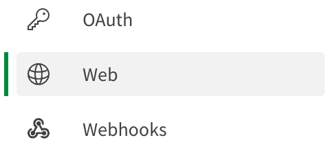</img>

Click the `Create new` button on the upper right side of the screen.

* In the `Name` input give your web integration a friendly name.
* In the `Add an origin` input enter the host URI for your web application.

> **Note:** If you're using [repl.it](https://replit.com), the origin you add will look something like this: `https://qlik-embedded-workshop.makethelogobigger.repl.co`.

* Click the Add button to set the origin as an allowed origin for this web integration.
* Click the Create button on the bottom right to create the web integration reference.

The configuration will look like this when it's complete.

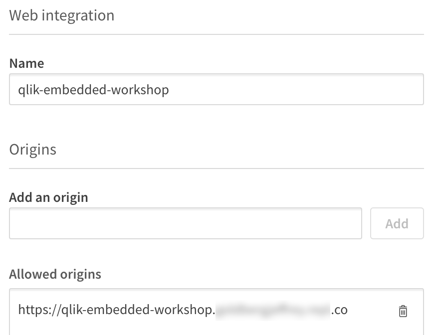</img>

An entry for the web integration will appear in the list in the middle of the screen. Record the web integration id value for use with the web application.

## 2.2 Add content security policy entry

Select `Content Security Policy` from the Management Console menu.

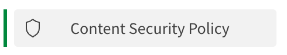</img>

Click the create `Add` button on the upper right side of the screen. The Add origin dialog window appears.

* Provide a name for the entry.
* In the `Origin` input enter the host URI for your web application **omitting** the `https://` from the entry. If your origin is *https://qlik-embedded-workshop.makethelogobigger.repl.co*, enter `qlik-embedded-workshop.makethelogobigger.repl.co` into the field.
* Select the checkbox next to `frame-ancestors` to activate the directive to allow iframe content from Qlik Cloud to be embedded into your web application.
* Click the Add button to save the entry.

The configuration will look like this when it's complete.

</img>

>**Note:** Please complete the steps below if the workshop application and embedded theme have not been added to your tenant. Otherwise, proceed to configure the web application.

## 2.3 Download content

Download the [Sales Analytics_Workshop.qvf](https://github.com/goldbergjeffrey/qlik-embedded-analytics-workshop/raw/main/content-to-upload/app/Sales%20Analytics_Workshop.qvf) file from the Github repository.

Download the [embeddedtheme.zip](https://github.com/goldbergjeffrey/qlik-embedded-analytics-workshop/raw/main/content-to-upload/theme/embeddedtheme.zip) file from the Github repository.

## 2.4 Import Qlik Sense app

Login to your Qlik Cloud tenant. When the hub appears, click the `Add new` button and select `Upload app` from the dropdown list.

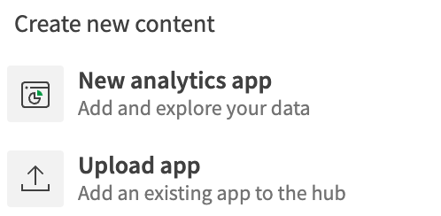</img>

In the dialog window that appears, browse for the Sales Analytics_Workshop.qvf file and select it. Then, click the `Upload` button.

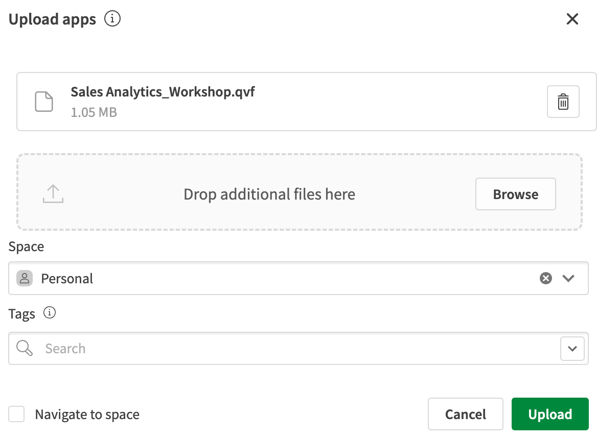</img>

A card for the app will appear in the hub. Mouse over the app and click the open button.

</img>

Record the ID (highlighted) of the app from the address bar in your web browser. You will use this in the web application configuration later in the workshop.

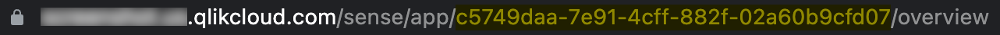

## 2.5 Import theme file

Click the Launcher menu (it looks like a waffle on the upper right of the screen) and select the Management Console icon.

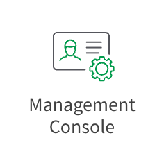</img>

Select `Themes` from the Management Console menu.

</img>

Click the `Add` button on the upper right side of the screen. Browse for the embeddedtheme.zip file you downloaded in [2.1](#21-download-content) and upload it to the tenant.

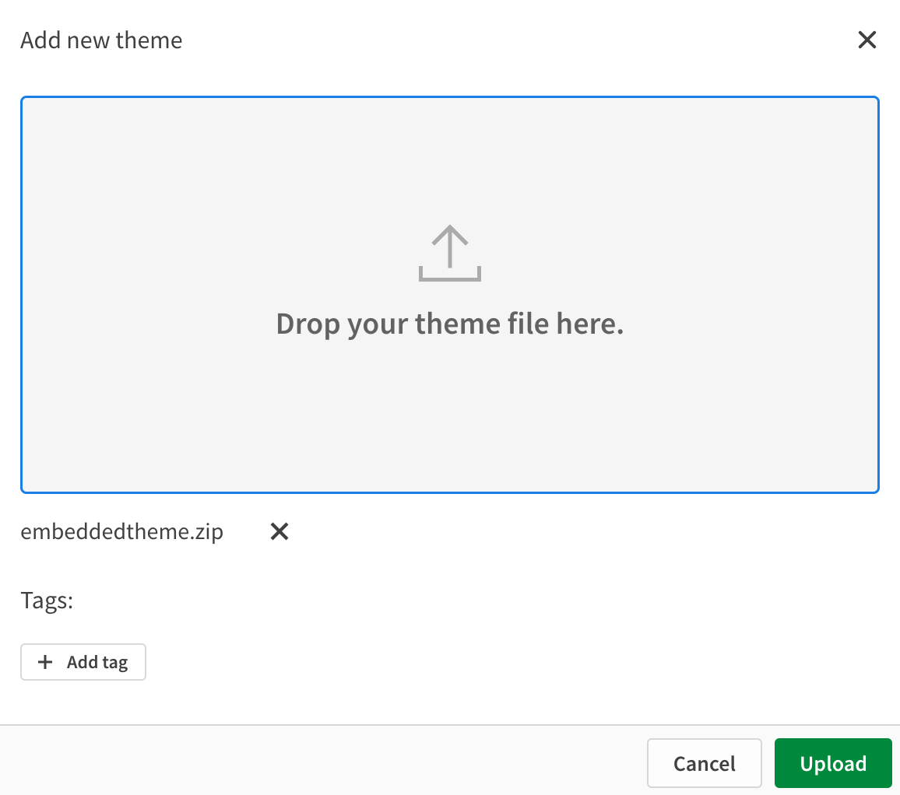</img>

# 3 Configure the web application

Access the config folder and open the `config.js` file.

```javascript
  module.exports = {
    qlikWebIntegrationId: "<WEB_INTEGRATION_ID>", //The value created in 2.4
    tenantHostname: "<TENANT_HOSTNAME>", //For example: example.us.qlikcloud.com
    appId: "<APP_GUID>", //For example: 9eb11ea5-a66f-4b07-be0c-c263a7aad51e
    sheetId: "a8bdb8b2-525e-486e-91d1-7318d362acee",
    theme: "embeddedtheme",
  };
```
Update these properties:

* `qlikWebIntegrationId`: The value you created in step 2.1
* `tenantHostname`: The domain URI for your tenant.
* `appId`: The value you copied in step 2.4 after importing the Qlik Sense application to your tenant.

Leave the remaining values untouched. Save the `config.js` file.

# 4 No-code embedded analytics

In this section, you are going to embed a sheet from a Qlik Sense application into the web application using an `<iframe>` tag.

In a web browser, navigate to your tenant and open the `Sales Analytics` app. This is the app you uploaded in step 2.4.

</img>

In the app overview, click on the `Customers Overview` sheet.

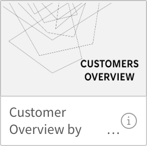</img>

When the sheet renders in the browser, click on the three dots button next to the Qlik logo and select `Embed sheet` from the menu.

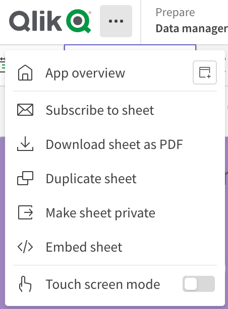</img>

The Embed sheet dialog appears. Bring your attention to the bottom of the dialog. This is where the embed code provided to you. The embed code contains all the information needed to render the sheet in your web application.

```html
<!-- example iframe embed code from Qlik Sense application -->
<iframe src="https://ironingboard.us.qlikcloud.com/single/?appid=599071c0-0de0-440c-bf8f-5b1a0a07ebcf&sheet=a8bdb8b2-525e-486e-91d1-7318d362acee&theme=embeddedtheme&opt=ctxmenu,currsel" style="border:none;width:100%;height:100%;"></iframe>
```

Press the `Copy` button to copy the code snippet to your clipboard. 

Open the `iframe.html` file of the workshop web application located in the `src` directory. Use the find command to search in the file for `no-code-embed`.

```html
<!-- begin no-code-embed exercise -->
            <iframe id="no-code-embed" src="" style="border:none;width:100%;height:100%;"></iframe>
<!-- end no-code-embed exercise -->
```

Replace the entire code snippet from `<iframe>` through `</iframe>` with the embed code from the application.

Save the `iframe.html` file.

Open the web application in its own tab by clicking on the square with arrow icon in the Webview address bar.


In the web application, click the iframe menu item on the left side of the screen. The sheet from Qlik Sense appears in the web application.

>**Note:** The iframe content will not render in the Webview because of content security policy. This is why you need to open the application in a separate window.

# 5 Pro-code embedded analytics

In this section, you are going to learn how to embed visualizations into the web application using JavaScript. For efficiency, this exercise contains completed scaffolding necessary for connecting to Qlik. If you want to learn about connecting to Qlik Cloud Analytics, keep reading. Otherwise, you can skip to step 5.2.

Pro-code embedding analytics requires two libraries: [enigma.js](https://qlik.dev/toolkits/enigma-js/) for back-end communication to the Qlik Analytics engine, and nebula.js for rendering visualizations in your web applications.

## 5.1 Connect to Qlik Cloud Analytics

Learn how to make a connection to the Qlik Analytics engine for use in your web application.

Open the `mashup.js` file of the workshop web application located in the `src/qlik/` directory for editing.

Get the configuration from the web application. 

```js
  const config = await fetch("config").then((response) => response.json());
```

This will enable using substitution throughout the rest of the code for items like your tenant, the web integration id, and the appId.

To prevent cross-site scripting request forgery (CSRF) to your tenant, Qlik cloud requires web applications to request a CSRF token for browser-based use cases.

Request a CSRF token using the `tenantHostname` and `qlikWebIntegrationId` properties from the config.

```js
  const csrfTokenInfo = await fetch(
    `https://${config.tenantHostname}/api/v1/csrf-token?qlik-web-integration-id=${config.qlikWebIntegrationId}`,
    {
      credentials: "include",
      headers: {
        "Qlik-Web-Integration-ID": config.qlikWebIntegrationId,
      },
    }
  );
  console.log("Token ", csrfTokenInfo.headers.get("qlik-csrf-token"));
```

Construct a URL for connecting to the Qlik Sense app you want to embed visualizations from using the `tenantHostname`, `appId, `qlikWebIntegrationId`, and the CSRF token you obtained earlier.

```js
  const url = `wss://${config.tenantHostname}/app/${
    config.appId
  }?qlik-web-integration-id=${
    config.qlikWebIntegrationId
  }&qlik-csrf-token=${csrfTokenInfo.headers.get("qlik-csrf-token")}`;
```

Before creating session with the Qlik Cloud Analytics engine, you need to fetch a schema to be able to communicate with the API.

```js
const schema = await (
    await fetch("https://unpkg.com/enigma.js/schemas/3.2.json")
  ).json();
```

Use the `schema` and `url` to create a session to Qlik Cloud using the [enigma.js](https://qlik.dev/toolkits/enigma-js/) library.

```js
const session = window.enigma.create({ schema, url });
```

Open the session by specifying the `appId` from the config.

```js
const app = await (await session.open()).openDoc(config.appId);
```

After connecting to Qlik Cloud you can use the `app` reference to embed visualizations using nebula.js from the Qlik Sense application into the web application.

Define a variable to connect nebula.js to the Qlik Sense application.

```js
const qlikEmbed = window.stardust.embed(app, {});
```

Inside the `{}` there are a number of properties you can configure to instruct the nebula.js library.

Set the `flags` property to support linechart forecasting

```js
flags: { LINECHART_FORECAST: true },
```

Add the visualization libraries you intend to embed into the web application using the `types` property.

```js
types: [
      {
        name: "linechart",
        load: () => Promise.resolve(window["sn-line-chart"]),
      },
      {
        name: "piechart",
        load: () => Promise.resolve(window["sn-pie-chart"]),
      },
      {
        name: "barchart",
        load: () => Promise.resolve(window["sn-bar-chart"]),
      },
      {
        name: "kpi",
        load: () => Promise.resolve(window["sn-kpi"]),
      },
      {
        name: "treemap",
        load: () => Promise.resolve(window["sn-treemap"]),
      },
    ],
```

With nebula.js configuration complete, you can use the `qlikEmbed` variable to render visualizations in the web application.

## 5.2 Embed objects from Qlik Sense applications

In this section, you're going to use the `qlikEmbed` variable from Step 5.1 to render visualizations in the workshop web application.

Open the `mashup.js` file of the workshop web application located in the `src/qlik/` directory for editing.

Search in the file for `embed-objects-section` and go to that line.

Add this render function below the line.
```js
qlikEmbed.render({
  element: document.getElementById('KPI01'),
  id:'ejNeB'
});
```
Save the `mashup.js` file.

Open the web application and you can see a KPI object has appeared at the top of the page. Add the remaining functions to render the objects in the web application.

```js
qlikEmbed.render({
    element:document.getElementById('KPI02'),
    id:'AjaEfsc'
  });

qlikEmbed.render({
    element: document.getElementById('KPI03'),
    id: 'wwSHz',
  });

qlikEmbed.render({
    element: document.getElementById('QV01'),
    id: 'mAbpP',
  });

qlikEmbed.render({
    element: document.getElementById('QV02'),
    id: 'LzuJNJ',
  });
```

Save the `mashup.js` file.

The `render` function uses the `element` property to identify where in the HTML page to place the visualization. The `id` property is the unique identifier for the visualization in the Qlik Sense application.

>**Note:** Finding the unique identifiers for Qlik objects can be a pain. Thankfully, there are some great tools out there that make it easier like the [Add Sense](https://chrome.google.com/webstore/detail/add-sense/bbiljflfafkaejgdebbnmcohpidgkejj) Chrome extension.

## 5.3 Embed visualizations using expressions

In addition to rendering visualizations that exist in a Qlik Sense application, you can create visualizations dynamically on-the-fly using expressions.

Open the `mashup.js` file of the workshop web application located in the `src/qlik/` directory for editing.

Search in the file for `on-the-fly-section` and go to that line.

Add this render function below the line.

```js
qlikEmbed.render({
  element: document.getElementById('QV04'),
  type: 'barchart',
  fields: ['CategoryName', "=sum(Sales)"],
});
```

Save the `mashup.js` file.

In this `render` function, the `element` property serves the same purpose as before, instructing qlikEmbed where to render the visualization in the web application. Instead of the `id` property, two alternative properties are in place: the `type` and the `fields` properties.

The `type` property specifies the chart type to render. 

The `fields` property accepts an array of field names and expressions to bring the chart to life.

# 6 Embed the selections bar

One of the most common needs the users have during their analytics activities is to keep track about the context of selections they are applying to the data.

## 6.1 Add selection bar placeholder

Open the `index.html` file for editing. Search in the file for `selection-bar-entry`.

Create a new line in the file below the comment and add a `div` tag as a placeholder for the selection bar. 

```html
<div class="curr-selections" id="currentSelections" ></div>
```

Save the `index.html` file.

## 6.2 Render selection bar

Open the `mashup.js` file for editing. Search in the file for `selection-bar-entry`.

Create a new line in the file below the comment and mount the nebula `selections` component to the `div` tag placeholder.

```js
(await qlikEmbed.selections()).mount(document.querySelector('.curr-selections'));
```

Save the `mashup.js` file.

Refresh the web application and the selection bar appears at the top of the page. Click inside one of the embedded visualizations and make a selection. The selection bar will update with the current selections you've made.

# 7 Implement a custom theme

Custom themes enable the visualizations you're embedding into your web applications match your branding and styling guidelines.

Open the `mashup.js` file for editing. Search in the file for `fetch-theme`.

Create a new line below the comment and add a new variable to fetch the theme file you uploaded in step 2.5.

```js
const themeFile =  await fetch("theme").then((response) => response.json());
```

Search in the file for `theme-property`. Add the `theme` property to the `qlikEmbed` nebula object and load the fetched theme file.

```js
themes:[
  {
      id: 'custom_theme',
      load: () => Promise.resolve(themeFile),
  }
],
```

Search in the file for `context-property`. Add the `context` property to instruct the `qlikEmbed` renderer to use the custom theme.

```js
context: {
  theme: 'custom_theme',
  language: 'en-US',
},
```

Save the `mashup.js` file and refresh the web application in the browser. The visualizations colors will change to those specified in the theme.

# 8 Trigger events on analytics data

You can do more than embed visualizations when you embed Qlik Cloud Analytics. The engine you connected to in step 5.1 enables you to execute functions and trigger events on the analytics data in the application directly.

## 8.1 Clear selections

For example, you can add a button to the web application that clears all of the selections that have been made.

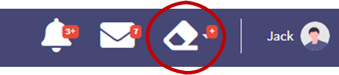

To add a clear all selections function to the eraser button seen in the image above, open the `mashup.js` file and search in the file for `clear-all`.

Add a click event to the code so that when the eraser is clicked, the web application calls the `app.clearAll()` function on the analytics application running on Qlik Cloud.

```js
$('#clearAll').click(async function() { 
  app.clearAll();
});
```

Save `mashup.js`. Go to the web application and make some selections in the embedded visualizations. Then click on the eraser icon and observe the content goes back to the default selection.

## 8.2 Select a specific field value

You can also contact the data model directly and apply selections to the embedded visualizations. In this section, you are going to add a button to the `index.html` page and connect it to a function in `mashup.js` that will select the field value "Italy" from the "Country" field in the analytics application's data model.

### 8.2.1 Add the country filter button

Open the `index.html` file for editing. Search in the file for `italy-filter-button`.

Create a new line in the file below the comment and add an anchor (`a`) tag defining the filter button.

```html
<a id="SelectionButton" href="#" class="d-none d-sm-inline-block btn btn-sm btn-primary shadow-sm">
  <i class="fas fa-filter fa-sm text-white-50"></i>Italy
</a>
```

Save the `index.html` file.

### 8.2.2 Select the value from the field

Open the `mashup.js` file for editing. Search in the file for `italy-filter-button`.

Create a new line in the file below the comment and add the code snippet. 

```js
$("#SelectionButton").click(async function() {
  let countryField = await app.getField("Country");
  await countryField.selectValues( {
    "qFieldValues": [
      {
        "qText": 'Italy'
      }
    ]
  });  
});
```

The click event executes a `getField` command on the `app` to work with the `"Country"` field in the data model. Then it calls the `selectValues` function passing in a JSON payload.

* `qFieldValues`: An array of objects representing values of the field being queried.
* `qText`: A string representing the value to be selected from the field in the data model being queried.

To select multiple field values, the JSON payload for the `selectValues` function would look like the following.

```js
{
  "qFieldValues": [
    {
      "qText": 'Italy'
    },
    {
      "qText": 'France'
    }
  ]
}
```

Save the `mashup.js` file.

Refresh the web application and the button appears in the web application. When you click on it, the embedded visualizations will filter to show information associated with Italy.
