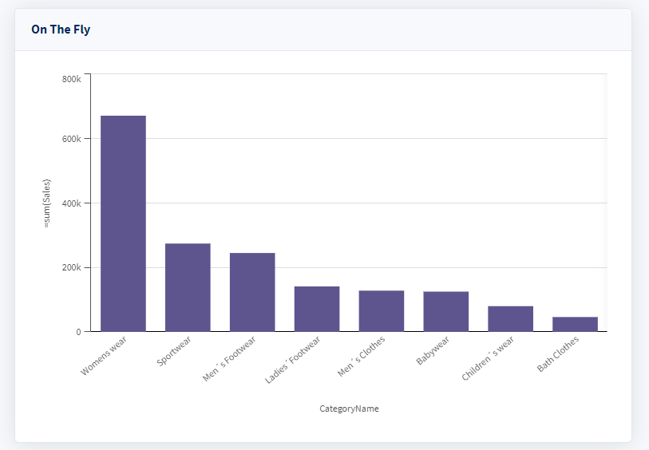
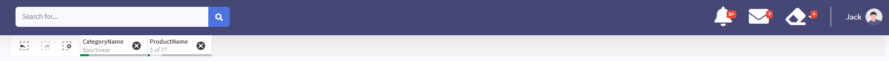
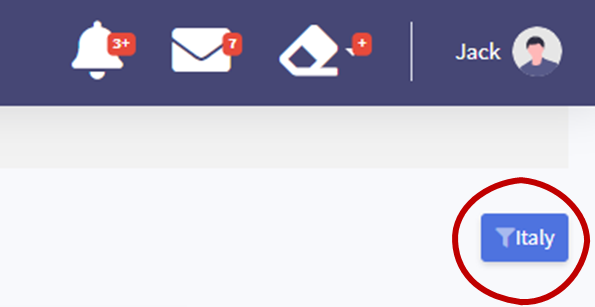
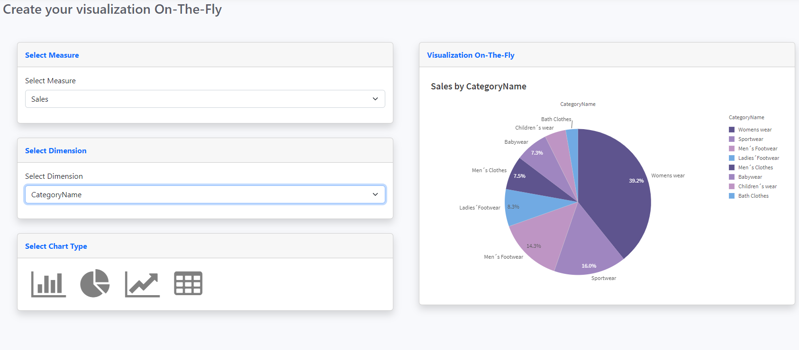

# Qlik Cloud Embedded Analytics Workshop

## Introduction

Welcome to this hands-on workshop on embedding visualizations from Qlik Cloud Analytics! In today's data-driven world, businesses need to quickly access and share insights from their data to make informed decisions. With Qlik Cloud Analytics, you can easily create powerful visualizations that enable you to explore your data and gain valuable insights.

In this workshop, we will guide you through the process of embedding visualizations from Qlik Cloud Analytics into your web applications, making it easier to share insights with your team or customers. You will learn how to leverage the Qlik Cloud Analytics APIs and embed codes to integrate visualizations directly into your web pages.

This workshop is designed for individuals with a basic understanding of web development, but no prior experience with Qlik Cloud Analytics is required. We'll start with some tenant configuration, then dive into the hands-on exercises where you will get to practice embedding visualizations into this web application.

By the end of this workshop, you will have the skills to integrate powerful data visualizations from Qlik Cloud Analytics into your web applications, allowing you to deliver insights to your stakeholders quickly and easily.


## Requirements

* A Qlik Cloud tenant
* An account on the tenant with the Tenant Admin role
* A Github account
* A development environment such as Visual Studio Code or an online IDE like [repl.it](https://replit.com/).
* You are logged into the tenant as a user with access to the Qlik Cloud Analytics application

> **Note: This workshop does not cover authentication options for securing web applications with Qlik Cloud.**
> For more information on authentication and authorization for embedded applications [review the documentation](https://qlik.dev/authenticate) on [qlik.dev](https://qlik.dev).

> **Note:** This workshop is built to work on [repl.it](https://replit.com/). If you're going through this workshop with another online IDE or a local development environment, your mileage may vary. 

## Workshop steps

- [1 Configure the Qlik Cloud tenant](#1-configure-the-qlik-cloud-tenant)
  - [1.1 Download content](#11-download-content)
  - [1.2 Import Qlik Sense app](#12-import-qlik-sense-app)
  - [1.3 Import theme file](#13-import-theme-file)
  - [1.4 Create a web integration](#14-create-a-web-integration)
  - [1.5 Add content security policy entry](#15-add-content-security-policy-entry)
- [2 Configure the web application](#2-configure-the-web-application)
  - [2.1 Update the config file](#21-update-the-config-file)
  - [2.2 Install npm packages](#22-install-npm-packages)
- [3 Start the web application](#3-start-the-application)
- [4 Embed visualizations](#4-embed-visualizations)
  - [4.1 No-code embedded analytics](#41-no-code-embedded-analytics)
  - [4.2 Low-code embedded analytics](#42-low-code-embedded-analytics)
    - [4.2.1 Existing visualization from an app](#421-existing-visualization-from-an-app)
    - [4.2.2 Dynamic visualization from expressions](#422-Dynamic-visualization-from-expressions)
- [5 Embed ui components](#5-embed-ui-components)
  - [5.1 The selections bar](#51-the-selection-bar)
  - [5.2 Implement a custom theme](#52-implement-a-custom-theme)
- [6 Trigger Qlik Sense actions](#6-trigger-qlik-sense-actions)
  - [6.1 Clear selections](#61-clear-selections)
  - [6.2 Apply a specific field value](#62-apply-a-specific-field-value)
- [7 Bonus time](#7-bonus-time)
  - [7.1 Advanced dynamic visualization](#71-advanced-dynamic-visualization)
  - [7.2 Next generation embedded analytics ALPHA](#72-next-generation-embedded-analytics-alpha)

## 1 Configure the Qlik Cloud tenant

### 1.1 Download content

Download the [Sales Analytics_Workshop.qvf](https://github.com/goldbergjeffrey/qlik-embedded-analytics-workshop/raw/main/content-to-upload/app/Sales%20Analytics_Workshop.qvf) file from the Github repository.

Download the [embeddedtheme.zip](https://github.com/goldbergjeffrey/qlik-embedded-analytics-workshop/raw/main/content-to-upload/theme/embeddedtheme.zip) file from the Github repository.

### 1.2 Import Qlik Sense app

Login to your Qlik Cloud tenant. When the hub appears, click the `Add new` button and select `Upload app` from the dropdown list.

</img>

In the dialog window that appears, browse for the Sales Analytics_Workshop.qvf file and select it. Then, click the `Upload` button.

</img>

A card for the app will appear in the hub. Mouse over the app and click the open button.

</img>

Record the ID (highlighted) of the app from the address bar in your web browser. You will use this in the web application configuration later in the workshop.


### 1.3 Import theme file

Click the Launcher menu (it looks like a waffle on the upper right of the screen) and select the Management Console icon.

</img>

Select `Themes` from the Management Console menu.

</img>

Click the `Add` button on the upper right side of the screen. Browse for the embeddedtheme.zip file you downloaded in [1.1](#11-download-content) and upload it to the tenant.

</img>

### 1.4 Create a web integration

Select `Web` from the Management Console menu.

</img>

Click the `Create new` button on the upper right side of the screen.

* In the `Name` input give your web integration a friendly name.
* In the `Add an origin` input enter the host URI for your web application.

> **Note:** If you're using [repl.it](https://replit.com), the origin you add will look something like this: `https://qlik-embedded-workshop.makethelogobigger.repl.co`.

* Click the Add button to set the origin as an allowed origin for this web integration.
* Click the Create button on the bottom right to create the web integration reference.

The configuration will look like this when it's complete.

</img>

An entry for the web integration will appear in the list in the middle of the screen. Record the web integration id value for use with the web application.

### 1.5 Add content security policy entry

Select `Content Security Policy` from the Management Console menu.

</img>

Click the create `Add` button on the upper right side of the screen. The Add origin dialog window appears.

* Provide a name for the entry.
* In the `Origin` input enter the host URI for your web application **omitting** the `https://` from the entry. If your origin is *https://qlik-embedded-workshop.makethelogobigger.repl.co*, enter `qlik-embedded-workshop.makethelogobigger.repl.co` into the field.
* Select the checkbox next to `frame-ancestors` to activate the directive to allow iframe content from Qlik Cloud to be embedded into your web application.
* Click the Add button to save the entry.

The configuration will look like this when it's complete.

</img>

## 2 Configure the web application

### 2.1 Update the config file

Access the config folder and open the `config.js` file.

```javascript
  module.exports = {
    qlikWebIntegrationId: "<WEB_INTEGRATION_ID>", //The value created in 1.4
    tenantHostname: "<TENANT_HOSTNAME>", //For example: example.us.qlikcloud.com
    appId: "<APP_GUID>", //For example: 9eb11ea5-a66f-4b07-be0c-c263a7aad51e
    sheetId: "a8bdb8b2-525e-486e-91d1-7318d362acee",
    theme: "embeddedtheme",
  };
```
Update these properties:

* `qlikWebIntegrationId`: The value you created in [1.4](#14-create-a-web-integration)
* `tenantHostname`: The domain URI for your tenant.
* `appId`: The value you copied in [1.2](#12-import-qlik-sense-app) after importing the Qlik Sense application to your tenant.

Leave the remaining values untouched. Save the `config.js` file.

### 2.2 Install npm packages

Open a terminal or shell window. At the prompt, enter the command `npm install`. This will install the dependencies for running the web application.

## 3 Start the web application

In the terminal or shell window, enter the command `npm run start` at the prompt. This will start the web application.

## 4 Embed visualizations

Qlik offers a several no-code, low-code, and pro-code methods for embedding visualizations and data into your web applications.

* **no-code** options make it easy to copy a code snippet from Qlik Sense and add it to an html page.
* **low-code** options enable you to create dynamic visualizations in just a few lines of code and provide additional configuration options you can customize to modify an embedded object's behavior or user interface.
* **pro-code** libraries and SDKs give programmers total control of the Qlik platform with direct access to the Qlik Analytics engine and management control plane.

### 4.1 No-code embedded analytics

In this section, you are going to embed a sheet from a Qlik Sense application into the web application using an `<iframe>` tag.

In a web browser, navigate to your tenant and open the `Sales Analytics` app. This is the app you uploaded in [1.2 Import Qlik Sense app](#12-import-qlik-sense-app).

</img>

In the app overview, click on the `Customers Overview` sheet.

</img>

When the sheet renders in the browser, click on the three dots button next to the Qlik logo and select `Embed sheet` from the menu.

</img>

The Embed sheet dialog appears. Bring your attention to the bottom of the dialog. This is where the embed code provided to you. The embed code contains all the information needed to render the sheet in your web application.


`<iframe src="https://ironingboard.us.qlikcloud.com/single/?appid=599071c0-0de0-440c-bf8f-5b1a0a07ebcf&sheet=a8bdb8b2-525e-486e-91d1-7318d362acee&theme=embeddedtheme&opt=ctxmenu,currsel" style="border:none;width:100%;height:100%;"></iframe>`

<sub>Example iframe embed code from Qlik Sense</sub>

Press the `Copy` button to copy the code snippet to your clipboard. 

Open the `iframe.html` file. Use the find command to search in the file for `no-code-embed`.

Replace the entire code snippet from `<iframe>` through `</iframe>` with the embed code from the application.

Save the `iframe.html` file.

In the web application, click the iframe menu item on the left side of the screen. The sheet from Qlik Sense appears in the web application.

## 3. Javascript integration (Nebula.js)
Qlik modern Embedded Analytics solutions offers a stack of open-source libraries to build customized analytical platforms backed up with the robustness of Qlik’s Associative Engine. Historically, [Capability APIs](https://qlik.dev/apis/javascript/capabilities) have been extensively used to build mashups and perform application related operations. A more modern alternative and framework-agnostic offering to Capability API-based operations is [Nebula.js](https://qlik.dev/libraries-and-tools/nebulajs) and [Enigma.js](https://qlik.dev/libraries-and-tools/enigmajs).

**Enigma.js** is an open source library, developed on GitHub that helps you to communicate with the Qlik associative engine. You can use it as a wrapper to connect to Qlik Associative Engine and by using QIX api methods. 
On the other hand, **Nebula.js** is an open source library, developed on GitHub as a collection of product and framework agnostic JavaScript libraries and APIs that helps developers integrate visualizations and mashups on top of the Qlik associative engine.

**How this works?** The first thing we need to do is to install or import the right libraries to be used in the project. For this workshop we have already imported in the header of *index.html* HTML file located under */src/* path both *Enigma.js* and *Nebula.js* libraries. In particular for *Nebula.js* we've loaded all the visualization types needed for embedding the objects of the app. This can be obtained by importing the module in the .html file or either by installing the required modules via `npm`.  In **mashup.js** located under */qlik/* folder, we have already established a *websocket* connection to Qlik Engine and once a session has been created, we've opened the app using QIX Engine APIs *openDoc()* method. 
```javascript
    // Open the application
    const app = await (await session.open()).openDoc(config.appId);
``` 
Moreover we have already configured *nuked*, e.g. the *Nebula.js* object where we've declared all the types of visualizations we want to embed.
 * **JS**  To embed an existing visualizations inside the HTML template, *index.html* webpage, write the following snippet of code inside *mashup.js* script:
    ```javascript
    //3. Embed using Nebula.js
    nuked.render({
        element:document.getElementById('KPI01'),
        id:'ejNeB'
      });
    ```

### 1.1 Import content


'KPI01' is the div tag contained in *index.html* HTML file where we are going to embed the object while 'ejNeB' is the id of the chart we want to embed. The id of a chart can be easily obtained by right clicking on an existing object --> share --> embed. In particular, in the example above we have placed the KPI with that particular id inside the div 'KPI01'.

We will do the same for the other objects we want to place inside the .html page, e.g. :
```javascript
nuked.render({
    element:document.getElementById('KPI02'),
    id:'AjaEfsc'
  });

nuked.render({
    element: document.getElementById('KPI03'),
    id: 'wwSHz',
  });

nuked.render({
    element: document.getElementById('QV01'),
    id: 'mAbpP',
  });

nuked.render({
    element: document.getElementById('QV02'),
    id: 'LzuJNJ',
  });

```
Save the file and try to click on JS Analytics in the portal to see the charts are rendered on the page.

## 4. On The Fly Visualization (Nebula.js)
You can even create **visualizations on-the-fly** using *Nebula.js*, i.e. visualizations that don't exists in the Qlik Sense app but that can be rendered on-the-fly by using the dimensions and measures contained in the app's data model. 
<br>
Let's place in div-tag *QV04* a barchart displaying for example  *Sales by CategoryName*. 
<p>

</p>

* **JS**: place on-the-fly code snippet in *mashup.js* file after the part of the script where we open the app and nuked object created.

  ```javascript
  //4. Embed On-The-Fly charts
  nuked.render({
      element:document.getElementById('QV04'),
      type: 'barchart',
      fields: ['CategoryName', "=sum(Sales)"],

    });
  ```

## 5. Embed Selections bar
One of the most common needs the users have during their analytics activities is to keep track about the context of selections they are applying to the data. That's where the selections bar comes in handy. In order to insert the **selections bar** we need to work both on HTML and JS.

<p>

</p>

* **HTML** : in *index.html* place a new div tag belonging to 'curr-selections' class with id 'currentSelections' at the beginning of *Begin Page Content* section. Insert the code below where the <!-- Selection Bar --> is placed.
    ```HTML
    <!-- Selection Bar -->
    <div class="curr-selections" id="currentSelections" ></div>
    ```
                              
* **JS** : in *mashup.js* we use Nebula to retrieve current Selections and we insert the selectionBar inside the new div we've created above.
   ```javascript                    
    //5. paste your code here to embed the Selections bar
  (await nuked.selections()).mount(document.querySelector('.curr-selections'));
    ```
<br>

## 6. Apply a Theme in the embedded scenario
Qlik Sense comes with four default themes (Sense Classic, Sense Focus, Sense Breeze, and Qlik Horizon) and in addition to these you can create custom themes based on your company color palettes, fonts etc. With custom themes you can precisely style an app by changing the colors, adding images and backgrounds as well as specifying the font sizes and font colors on a global or granular basis throughout your app. You can also define color palettes to be used and customize the specifications for margins, padding and spacing. The theme you created can be applied as well in the embedded scenario to merge Qlik Sense Analytics with the look&feel of your web application.

In order to apply a theme to a Nebula.js integrations, please follow these steps:

* **JS**: in *mashup.js* script we need to fetch the theme file from backend (located in */themes/* folder), then we declare it in the nuked object. Please make sure you paste the code below into the JS file at the positions according to the comments.

* 6.1. Fetch the theme file 
   ```javascript
  //6.1 fetch the theme file from backend
  const themeFile =  await fetch("theme").then((response) =>
      response.json()
    )
  ```
* 6.2 Add the theme to the theme's array in Nuked
  ```javascript
  //6.2 in Nuked (window.stardust.embed...), add themes array
    themes:[
      {
          id: 'custom_theme',
          load: () => Promise.resolve(themeFile),
      }
      ],
  ```
* 6.3 as the last step we need to specify we are using this theme in the context dictionary:
  ```javascript
      //6.3 in context apply theme
      context: {
          theme: 'custom_theme',
          language: 'en-US',
          },
  ```

## 7. Trigger some actions via APIs on Qlik Engine
The final step of the workshop is to see how you can perform a bi-directional integration to permit to your web app to communicate with Qlik Engine and viceversa.
Here's where our Open APIs approach has a key role since it permits to trigger actions to Qlik Associative Engine from an external component of your web page. 

### 7.1 Clear all filters
With QIX engine APIs is possible to add a click handler to a custom HTML component, made with Bootstrap (see rubber icon below), that when it gets executed for example it clears all selections in all fields of the current Qlik Sense app.
<p>

</p>

* **JS**: place the .click handler made with JQuery inside *mashup.js* script.

  ```javascript
  // 7.1 Reset Selections in Mashup.js
    $('#clearAll').click(async function() { 
        app.clearAll();
    });
  ```

### 7.2 Apply selection: 'Italy'
It's possible to build a custom HTML Button, made with Bootstrap, and add a click handler that when it gets executed, it uses the *app.field.selectValues()* method to select specific values in a field.
<p>

</p>

* **HTML**: place the the button in the html page inside *Page Heading* section.
  ```HTML
  <!-- Insert Selection Button -->        
  <a id="SelectionButton" href="#" class="d-none d-sm-inline-block btn btn-sm btn-primary shadow-sm"><i
          class="fas fa-filter fa-sm text-white-50"></i>Italy</a>
  ```
* **JS**: place the .click handler made with JQuery inside the js script.
  ```javascript
  //7.2 Select Country button handler: select Italy
    $("#SelectionButton").click(async function() {
      yearField = await app.getField("Country");
      await yearField.selectValues( {
        "qFieldValues": [
          {
            "qText": 'Italy'
          }
        ]
      });  
    });
  ```

## 8. On The Fly - advanced
As the final part of this workshop we just want to highlight that under On The Fly item of the sidebar you can play with an advanced on-the-fly mashup where you can dynamically change Measure, Dimension and Chart type and the chart is rendered accordingly on the right side of the page.
<p>

</p>

## Copyright and License
 Code released under the [MIT](https://github.com/jackBrioschi/Qlik-Cloud-Embedded-Analytics-Workshop/blob/main/LICENSE) license.
The HTML template used in this project is a partial remake of [sb-admin2 Bootstrap template](https://github.com/startbootstrap/startbootstrap-sb-admin-2).
